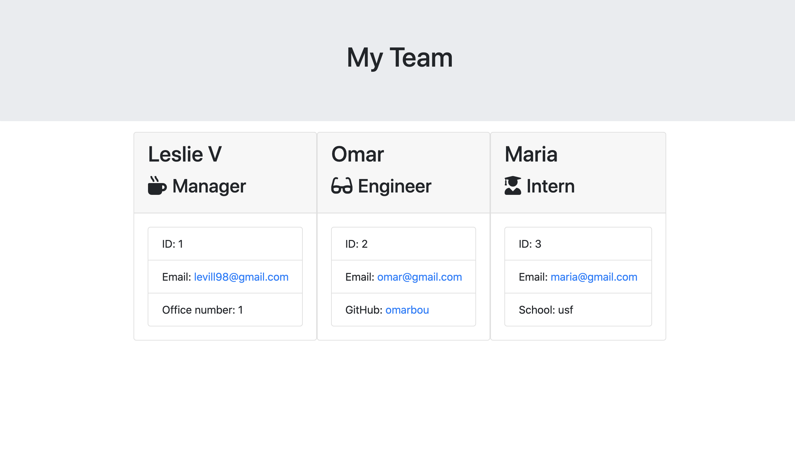

# Employee Generator

This Node CLI takes in information about employees and generates an HTML webpage that displays summaries for each person including their ID, email, and office number.

 ## Web application Image

 

 Example of a Team summary application

## Installation
Run:

                npm i

## Usage

This command line app generates a HTML from a user's input. The application runs with the following command:

                node app.js
            

## Built With

* Jest NPM package
* Inquirer NPM packahe
* Git 
* GitHub 

## Video Demo Link

* [See Demo Video](https://drive.google.com/file/d/1ZHWiKR9yyfhy8FHxrCqW-I1RY4smHt9t/view)

## Authors

* **Leslie Villatoro** 

- [Link to Github](https://github.com/leslievill)
- [Link to LinkedIn](https://www.linkedin.com/in/leslievillatoro/)

## License

This project is licensed under the MIT License 
